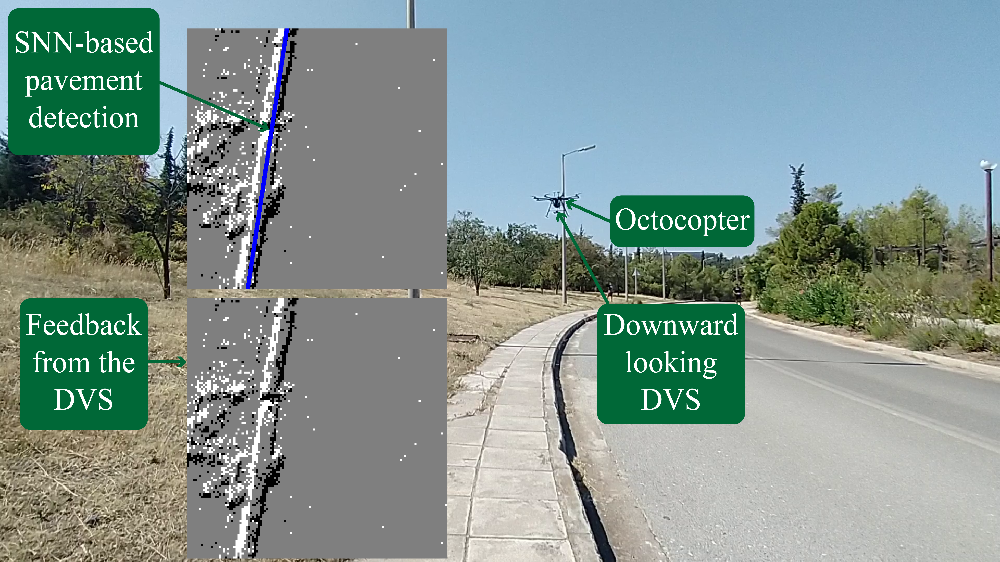

# A framework for **DVS** event streams manipulation and contour-based areas real-time detection and tracking, using **SpiNN-3** Neuromorphic platform.

## Overview


This repository contains the code used in my thesis, **Multicopter control using dynamic
vision and neuromorphic computing** which can be found [here](https://dspace.lib.ntua.gr/xmlui/handle/123456789/56541). The code is abstractly divided in the following categories.

- Scripts to manipulate aedat files (event streams recorded by event cameras e.g. DVS).
- Development of a contour-based areas real-time detection and tracking framework with
	- an SNN + jupyter notebooks (offline operation & tuning).
	- an SNN + ROS nodes written in C++ (real-time operation in embedded PC).

*The formulation and detailed explanation of the various modules in this framework can be found in the thesis document. Please read this prior to proceeding on this repository, to have a better understanding of the code.*

If you are interested in the interfacing of the DVS to SpiNN-3, using a custom FPGA design see the [spinn_aer_if](https://github.com/ntouev/spinn_aer_if) repository.

## Usage
### Basic repository setup
Clone the repository in your home folder and cd into it
``` shell
cd ~
git clone https://github.com/ntouev/ev_snn_percept
cd ev_snn_percept
```

Clone the AedatTools repository which contains tools for manipulating .aedat files, in Matlab and Python (only the Matlab scripts are used here).
``` shell
git clone https://github.com/qiaokaki/AedatTools
```
and move the contents of **matlab_scripts/** directory in **AedatTools/Matlab/**
``` shell
mv matlab_scripts/* AedatTools/Matlab/
```

These scripts build a functionality on top of the initial repository. Now, directory **matlab_scripts/** can be removed.
``` shell
rm -r matlab_scripts
```

Populate **aedat2/** directory with your recorded .aedat files. 

**Important!**
 A complete workflow is demonstrated, below, using the **aedat2/sample_pavement.aedat** file as the input event stream file. In the general case, change the *"sample_pavement"* naming, when present, using the name of your file, accordingly. 

### Data preprocessing
Build the following directory tree for your aedat file, i.e. **aedat2/sample_pavement**.
``` shell
mkdir -p binary/sample_pavement/csv
mkdir -p binary/sample_pavement/json
mkdir -p binary/sample_pavement/png
mkdir -p binary/sample_pavement/vis_annot
```

#### AedatTools/Matlab/manip.m
It takes as input the **aedat2/sample_pavement.aedat** file. It creates frames, by accumulating events for a given dt, which are then stored in **binary/sample_pavement/csv/** directory, in a csv format (practically, a 128x128 matrix of 0(no event), 1(ON), -1(OFF) values).
 
#### AedatTools/Matlab/aedat2_to_csv.m
It receives the **aedat2/sample_pavement.aedat** input file and extracts its contents in a csv format {x, y, timestamp (sec), polarity} in **CSVs/sample_pavement.csv** file.
	
*An event rate limiting can be applied to the initial aedat (e.g. to simulate the output of a real system where the event rate is limited due to a bandwidth bottleneck).
To use it, comment out the default piece of code and uncomment the commented one.*
   
#### AedatTools/Matlab/csv_to_aedat2.m
It converts a csv file (with the format mentioned above) to a .aedat file.

*No specific use here.*

#### spinnaker/scripts/annotate.ipynb
**Prerequisites:**
- Install labelme and opencv

``` shell
sudo apt install labelme
sudo apt install python3-opencv
```
Using labelme you can manually annotate the detected contour in the previously generated frames (**binary/sample_pavement/csv/**) by the **manip.m** script. Labelme is a tool to label 2D shapes in an image. The detection algorithm of this framework, however, detects lines. To allign in our case, label the line that represents the contour-based area using 3 points. The first two placed at the start and the end of the line while the third should match the first one. The annotations are extracted in numpy format in **binary/sample_pavement/annot_pav.npy** file and the visualization under **binary/sample_pavement/vis_annot/** directory.

### Hough SNN
#### csv-offline_ht_snn.py
**Prerequisites:** 
- Install [PyNN on SpiNNaker](http://spinnakermanchester.github.io/spynnaker/6.0.0/PyNNOnSpinnakerInstall.html) and familiarize with SpiNNaker board.
- Create a directory to store the training outcome.
``` shell
mkdir -p spinnaker/sample_pavement
```

This script takes as input the **CSVs/sample_pavement.csv** file. It parses the file and generates the appropriate structure that will later feed the events, in simulation, just if it was a real-time input. The user defines the SNN's dimensions and weights. The architecture is described in Chapter 3 of the thesis. Then the SNN is loaded into SpiNNaker and as soon as the simulation is over, the script outputs a png and a numpy file that contains the timestamped spikes of the planar population. The png file serves as a visualization/validation tool of the output while the numpy file is the input to the next module, the tracking algorithm. The names of the output files contain all the information of the user set parameters.

### Tracking Algorithm
#### tracking.ipynb
This script receives the SNN output numpy file and runs the tracking algorithm using the parameters provided by the user. It outputs the results in a subdirectory of **spinnaker/sample_pavement/**. The name of this subdirectory contains all the user defined parameters (SNN + tracking algorithm). 

The outcome is 2 numpy files containing timestamped contour detections and extracted features, 2 png files comparing annotated-predicted r and theta values, and visualization (frames) of the detected pavement together with its corresponding ON and OFF clusters.

### Deploying the C++ version of the framework on an embedded pc under ROS.
Directory **ROS_code/** contains the code of the C++ version of the framework.  It is not a complete package, it just contains the code. Follow the steps below to build the appropriate package.

**Prerequisites**
- Download the [Visualiser](https://github.com/SpiNNakerManchester/Visualiser) repository provided by the Manchester Group inside the parent directory, **~/ev_snn_percept**/. This provides a C++ API for the development of the callback function (of the output population) instead of the default Python one. Its use is crucial in order to achieve a latency lower than 1 msec. 
``` shell
git clone https://github.com/SpiNNakerManchester/Visualiser.git
```
To gain some intuition about the use of the Visualiser repository and its lower level logic look at the **Visualiser/spynnaker_external_device_lib/** directory. This includes some examples that send and receive spikes during simulation.
- OpenCV needs to be installed in your system (Done in previous step).

Now create a new ROS package using a name of your preference. Modify the **"package_name"**, where present in the code, with your package name.

Move the source and messages files from **ROS_code/src/** and **ROS_code/msg/** respectively into your package.

Add the contents below to your **package.xml** file,
```xml
<build_depend>message_generation</build_depend>
<exec_depend>message_runtime</exec_depend>

<buildtool_depend>catkin</buildtool_depend>
<build_depend>roscpp</build_depend>
<build_depend>rospy</build_depend>
<build_depend>std_msgs</build_depend>
<build_depend>OpenCV</build_depend>
<build_export_depend>roscpp</build_export_depend>
<build_export_depend>rospy</build_export_depend>
<build_export_depend>std_msgs</build_export_depend>
<build_export_depend>OpenCV</build_export_depend>
<exec_depend>roscpp</exec_depend>
<exec_depend>rospy</exec_depend>
<exec_depend>std_msgs</exec_depend>
<exec_depend>OpenCV</exec_depend>
```

and this code in your **CMakeLists.txt**.
``` CMake
set(OpenCV_DIR "/usr/lib/aarch64-linux-gnu/cmake/opencv4") # add this line if the find_package can not locate opencv; assumes ARM architecture
find_package(catkin REQUIRED COMPONENTS
  roscpp
  rospy
  std_msgs
  message_generation
  OpenCV
)

add_message_files(
    FILES
    LinePolar.msg
    Feature.msg
    Spike.msg
)

generate_messages(
  DEPENDENCIES
  std_msgs
)

catkin_package(
    CATKIN_DEPENDS message_runtime
)

include_directories(
  ${catkin_INCLUDE_DIRS}
  ${OpenCV_INCLUDE_DIRS}
)

add_executable(live_output src/live_output.cpp src/receiver_if.cpp)
# ARM architecture is assumed for the libraries below 
target_link_libraries(live_output ${catkin_LIBRARIES} ~/ev_snn_percept/Visualiser/spynnaker_external_device_lib/libspynnaker_external_device_lib.a /usr/lib/aarch64-linux-gnu/libpthread.so /usr/lib/aarch64-linux-gnu/libsqlite3.so)
add_dependencies(live_output ${${PROJECT_NAME}_EXPORTED_TARGETS} ${catkin_EXPORTED_TARGETS})

add_executable(tracker src/tracker.cpp)
target_link_libraries(tracker ${catkin_LIBRARIES})
add_dependencies(tracker ${${PROJECT_NAME}_EXPORTED_TARGETS} ${catkin_EXPORTED_TARGETS})

add_executable(featurer src/featurer.cpp)
target_link_libraries(featurer ${catkin_LIBRARIES})
add_dependencies(featurer ${${PROJECT_NAME}_EXPORTED_TARGETS} ${catkin_EXPORTED_TARGETS})

add_executable(visualizer src/visualizer.cpp)
target_link_libraries(visualizer ${OpenCV_LIBS} ${catkin_LIBRARIES})
add_dependencies(visualizer ${${PROJECT_NAME}_EXPORTED_TARGETS} ${catkin_EXPORTED_TARGETS})
```

Now build the package. Four nodes should be generated:
- **live_output:** Receives spikes from the  output population and publishes them as **Spike.msg** messages in **/spike** topic.
- **tracker:** Subscribes to **/spike** topic, implements the tracking algorithm and publishes **LinePolar.msg** messages (the tracked contour) in **/det_pav** topic.
- **featurer:** Subscribes to **/det_pav** topic, implements the feature extraction algorithm and publishes **Feature.msg** messages in **/feat** topic.
- **visualizer:** Subscribes to **/det_pav** topic and visualizes the detected contour with a straight line on a 2D window.

### Using the framework in real-time experiments.
- run **spinnaker/scripts/rt-online_ht_snn.py** to download the snn on the SpiNNaker machine. This script is similar to the **spinnaker/scripts/csv-offline_ht_snn.py**. The differences exist due to the different input, since now the spikes are fed in real-time using a DVS.
- run the 4 nodes
```shell
 rosrun package_name live_output
 rosrun package_name tracker
 rosrun package_name featurer
 rosrun package_name visualizer
```
- Use features from **/feat** topic to feed your controller.

## Extras
- Find topics from spinnaker user groups related to this work [here](https://groups.google.com/u/0/g/spinnakerusers/search?q=Vaggelis%20Ntouros)

